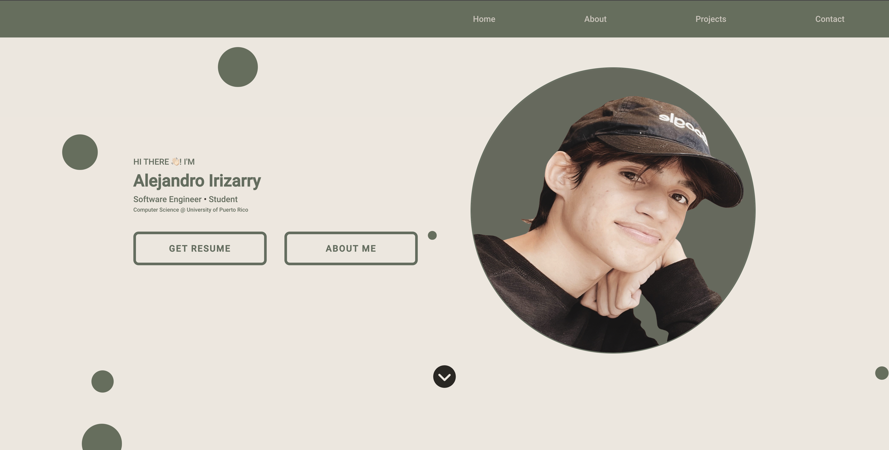

 <head>
    <link rel="stylesheet" href="/styles.css">
  </head>
    <body>
      <header></header>
      <!-- Socials -->
      <h3 align="left">Let's connect 🙌:</h3>
      

      
      
        

      <!-- Skills/Tools -->
      <h3 align="left">Software 💻:</h3>

  
  
   
   
    
   
    
  
   
   

 

 
 
 
  
  
Open to collaborate with other developers / <a href="mailto:alejandroirizarry@programmer.net">alejandroirizarry@programmer.net</a>

  
For professional opportunities or other inquiries / <a href="mailto:alejandroirizarry@mail.com">alejandroirizarry@mail.com</a>

  

  
  <h2>Want to learn more? Click below</h2>
  
  
 
